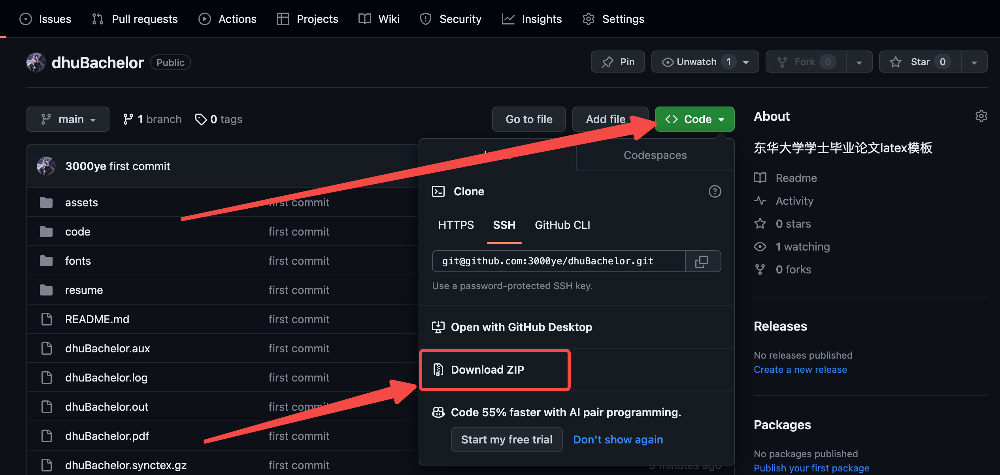

# 东华大学学士毕业论文 LaTeX 模板使用手册
## 导入模板
### 使用 Git 克隆仓库

将仓库克隆到你需要的位置：

```shell
git clone git@github.com:3000ye/dhuBachelor.git
# 或
git clone https://github.com/3000ye/dhuBachelor.git
```

### 下载 Zip 文件

如果你不会使用`Git`，可以进入网页：https://github.com/3000ye/dhuBachelor 然后下载`Zip`文件：

<div style="display: flex; justify-content: center;">

</div>

### 百度网盘分享链接

如果你没有科学代理，无法进入`Github`，可以使用百度网盘下载：

## 开始使用
### 安装字体

在使用模板之前，请先找到并打开`fonts`文件夹，安装里面的所有字体。

### 配置 TeX 环境

如果你是 $\LaTeX$ 小白，请先行阅读：[使用 LaTeX 优雅地完成创作](https://3000ye.com/p/elegant-latex/)，在这个教程里你可以学会如何安装并配置适合你的 $\TeX$ 环境。

### 尝试编译

使用你喜欢的编辑器，打开`dhuBachelor.tex`文件，选择`xelatex`命令编译文件。如果没有出现报错，同目录下会生成一个`dhuBachelor.pdf`文件，这就是我们的论文。

## 各个组件说明

看到这里，相信你已经成功编译好了模板文件，现在你可以在其基础上创作你的论文。

本模板的格式严格按照东华大学本科生毕业设计（论文）撰写规范设置，下面是一些会用到的组件的详细说明。

### 论文题目

根据要求，论文题目使用三号黑体，上下各空一行，居中显示。添加代码：

```tex
\reTitle{中文题目}
\reTitleEN{英文题目}
```

### 摘要

根据要求，摘要使用四号黑体，下面空一行，居中显示。添加代码：

```tex
\reAbstract % 中文摘要
\reAbstractEN % 英文摘要
```

摘要内容直接写在摘要下方，首行缩进两字符。

### 关键词

中文关键词：小四号黑体（标题），小四号宋体（关键词），逗号分隔，末尾没有标点符号。

英文关键词：Times New Roman（标题加黑）。

```tex
\reKeyword{关键词1，关键词2，关键词3，关键词4} % 中文关键词
\reKeywordEN{Keyword1, Keyword2, Keyword3} % 英文关键词
```

### 目录

目录标题需居中显示，添加代码：

```tex
\begin{center}
    \tableofcontents
\end{center}
```

### 各级标题

规范中明确给出，最多只能使用三级标题，其中一级标题需上下各空一行。

```tex
\reSection{一级标题}
\subsection{二级标题}
\subsubsection{三级标题}
```

### 有序列表

规范中并没有给出无序列表的样例，因此不建议使用，只用有序列表：

```tex
\orderedList{ % 使用 (i) 排序，缩进 2 字符
    \item 有序列表标题 \par % \par的作用是将内容换行
    这是有序列表的内容

    \item 有序列表标题 \par
    这是有序列表的内容
}
```

### 数学公式

行内公式：`$f(x) = x + 1$`

跨行公式：跨行公式请使用`equation`环境，默认按照章节自动编号。

```tex
\begin{equation}
    x = a_0 + \cfrac{1}{a_1 
            + \cfrac{1}{a_2 
            + \cfrac{1}{a_3 + \cfrac{1}{a_4} } } }
\end{equation}
```

### 插入图片

图片插入默认在文字下方，请严格按照模板的格式进行插入，使用时只需要改`width`大小和图片路径，并根据实际更改图例和索引。

注意：图片需要保存在`assets/`目录中才能被正确插入，读者可以自己新建其他目录实现插入。

```tex
\begin{figure}[H] % 图片位于文字下方
    \centering % 居中
    % 设置图片占页面宽度的比例（默认0.8）
    \includegraphics[width=0.8\textwidth]{assets/dataStructures.jpg}
    \caption{图片标题} % 图例，按章节编号
    \label{fig: 数据结构2} % 图片索引
\end{figure}
```

有时可能需要多图并排，模板使用`minipage`来实现并排展示，使用时可以修改子图所占比例：

```tex
\begin{figure}[H]
    \centering
    \begin{minipage}[c]{0.40\textwidth} %minipage使之保持同一行
    \centering
    \includegraphics[width=0.8\textwidth]{assets/dataStructures.jpg}\\
    \caption{图片1标题}
    \end{minipage}
    \hspace{1em}
    \begin{minipage}[c]{0.40\textwidth} %minipage使之保持同一行
    \centering
    \includegraphics[width=0.8\textwidth]{assets/dataStructures.jpg}\\
    \caption{图片2标题}
    \end{minipage}
\end{figure}
```

### 插入表格

使用 [excel2latex](https://www.ctan.org/pkg/excel2latex) 工具生成表格代码后，需要手动添加分割线（`\toprule, \midrule, \bottomrule`），以达到三线表的格式要求。

```tex
\begin{table}[H]
    \centering
    \caption{表格标题}
        \begin{tabular}{c||l}
        \toprule
        parameter  & Description \\
        \midrule
        $I$ & Land area collection \\
        $J$ & Flower pollination demand set \\
        $D_j$ & Number of pollinating bees required for flower pollination \\
        $T_k$ & Honeycomb size grade, $k = 1, 2, \cdots$ \\
        $B$ & Maximum number of hive \\
        $R_{ik}$ & Maximum influence radius of a single honeycomb \\
        \bottomrule
        \end{tabular}%
    \label{tab: 一个表}%
\end{table}%
```

对于需要多表并排的情况，和图片的方式类似，使用`minipage`来实现：

```tex
\begin{minipage}[c]{0.45\textwidth}
    \centering
    \begin{table}[H]
        \centering
        \caption{表格1标题}
            \begin{tabular}{c||lc}
            \toprule
            Symbol  & Description & Unit \\
            \midrule
            $t$ & $t_{th}$ year & $\sim$ \\
            $e_k$ & the error term & $\sim$ \\
            $X_{ij}$ & Raw data matrix & $\sim$ \\
            $Y_{ij}$ & Positive matrix & $\sim$ \\
            \bottomrule
            \end{tabular}%
        \label{tab: 表格1标题}%
    \end{table}%
\end{minipage}
\begin{minipage}[c]{0.45\textwidth}
    \centering
    \begin{table}[H]
        \centering
        \caption{表格2标题}
            \begin{tabular}{c||lc}
            \toprule
            Symbol  & Description & Unit \\
            \midrule
            $t$ & $t_{th}$ year & $\sim$ \\
            $e_k$ & the error term & $\sim$ \\
            $X_{ij}$ & Raw data matrix & $\sim$ \\
            $Y_{ij}$ & Positive matrix & $\sim$ \\
            \bottomrule
            \end{tabular}%
        \label{tab: 表格2标题}%
    \end{table}%
\end{minipage}
```

### 插入代码

可以直接在`.tex`文件中编写代码，并指定语言和标题：

```tex
\begin{lstlisting}[language=c++,title={code.cpp}]
#include "bits/stdc++.h"

using namespace std;

int main() {
    cout << "3000ye 的 LaTeX 模板！" << endl;

    return 0;
}
\end{lstlisting}
```

另一种更为推荐的方式是加载文件中的代码，代码文件需要保存在`assets/`目录下：

```tex
\lstinputlisting[language=c++, title=code.cpp]{code/code.cpp}
```

### 插入伪代码

使用宏包`algorithm, algorithmic`来实现伪代码的添加，具体实现可以查看文档，下面是一个简单示例：

```tex
\begin{algorithm}
    \caption{Example Pseudocode}
    \begin{algorithmic}
        \STATE $x\gets0$
        \IF {$x\leq 0$}
        \STATE $x\gets x+1$
        \ELSE
        \STATE $x\gets x-1$
        \ENDIF
    \end{algorithmic}
\end{algorithm}
```

### 参考文献

参考文献使用`\bibitem`来添加，添加时需要手动更改`{RNi}`索引（`i`是你文献的序号）。

```tex
\reference{
    \bibitem{RN1} 参考文献1
    \bibitem{RN2} 参考文献2
}
```

### 致谢

```tex
\reThanks{
    致谢，3000ye 的 \LaTeX 模板！
}
```